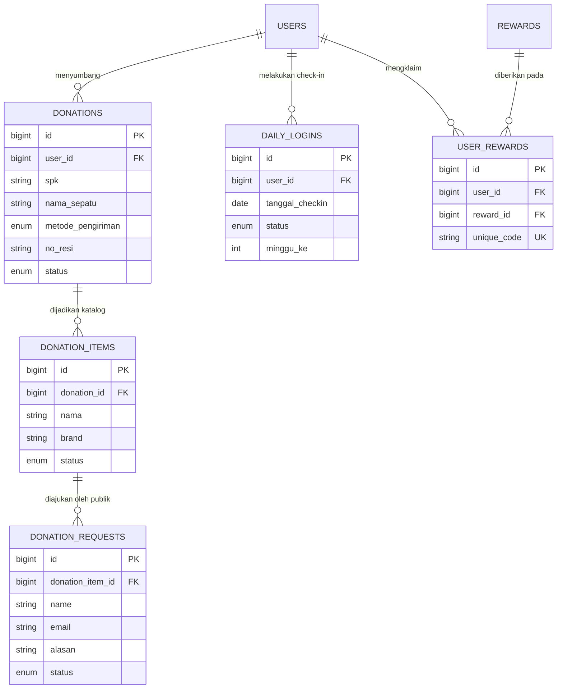

# Product Requirement Document (PRD) — Sepatu Donasi
## Kategori: Core Features (Donasi, Check-In, & Reward)

---

## 1. Pendahuluan & Ringkasan Produk
**Sepatu Donasi** adalah platform sosial digital yang memfasilitasi pengumpulan dan penyaluran sepatu layak pakai dari para donatur kepada pihak yang membutuhkan. Untuk meningkatkan keterlibatan dan retensi pengguna, platform ini mengintegrasikan sistem gamifikasi berupa **Check-in Harian** (dengan verifikasi unggah foto) dan **Sistem Reward** (penukaran kupon berdasarkan streak mingguan).

Dokumen ini memfokuskan kebutuhan fungsionalitas pada tiga pilar utama:
1. **Pilar Donasi (Relasional 3-Tahap)**: Formulir penyerahan donasi dari donatur, pembuatan katalog item oleh admin, dan pengajuan dari calon penerima manfaat.
2. **Pilar Check-In**: Perekaman bukti foto sepatu harian untuk membangun streak mingguan (dengan penanganan zona waktu lokal).
3. **Pilar Reward**: Manajemen stok hadiah kupon/voucher dan alur penukaran kode unik klaim terpusat.

---

## 2. Fitur Utama & Kebutuhan Fungsional

### 2.1. Alur & Fitur Donasi Sepatu (3-Tahap)
* **Tahap 1: Penyerahan Donasi (Donatur -> Admin)**:
  * Donatur mengirimkan data donasi sepatu (tabel `donations`) dengan mencantumkan: nama sepatu, ukuran (size), kondisi (0-100%), taksiran nilai, dan foto fisik sepatu.
  * Memilih metode pengiriman: `antar_langsung` atau `ekspedisi` (wajib mengisi nama kurir dan nomor resi).
* **Tahap 2: Kurasi & Katalogisasi (Admin)**:
  * Admin memverifikasi fisik sepatu yang tiba. Jika `diterima`, admin memindahkan/membuat entri sepatu tersebut ke dalam tabel **Katalog Donasi** (`donation_items`).
  * Admin melengkapi detail katalog seperti `kategori`, `brand`, dan status (`tersedia`).
* **Tahap 3: Pengajuan Penerima (Beneficiary -> Admin)**:
  * Publik (Calon penerima) dapat melihat katalog dan menekan tombol "Ajukan Sepatu Ini".
  * Sistem menyimpan data pengajuan di tabel `donation_requests` (nama, email, no_hp, alasan).
  * Admin menyetujui salah satu kandidat, lalu mengubah status `donation_items` menjadi `disalurkan`.

### 2.2. Alur & Fitur Daily Check-In (Gamifikasi)
* **Perekaman Check-in Harian**:
  * Pengguna terdaftar dapat melakukan check-in satu kali setiap hari dengan mengunggah foto sepatu.
  * **[CRITICAL REQUIREMENT]** Sistem wajib menggunakan zona waktu lokal (contoh: `Asia/Jakarta`) saat merekam `tanggal_checkin`. Jangan gunakan UTC untuk mencegah bug perhitungan *streak* akibat perbedaan waktu.
  * Sistem melacak nomor minggu (`minggu_ke`) dan urutan hari dalam minggu tersebut (`hari_ke`).
* **Streak Tracking & Verifikasi Admin**:
  * Status check-in default adalah `pending` dan butuh di-`approved` oleh admin.
  * Jika streak tercapai penuh (7 hari yang `approved`), status klaim hadiah diaktifkan.

### 2.3. Alur & Fitur Reward & Kupon
* **Manajemen Reward (Admin)**:
  * Admin mengelola database hadiah di tabel `rewards` (stok, masa berlaku, prasyarat `minggu_ke`).
* **Klaim Reward (User)**:
  * Pengguna yang memenuhi kualifikasi streak 7 hari dapat mengklaim hadiah.
  * **[CRITICAL REQUIREMENT - SOURCE OF TRUTH]**: Validasi apakah *user* sudah klaim di minggu tersebut HANYA mengacu pada tabel `user_rewards` (kombinasi unik `user_id, reward_id, minggu_ke`). Kolom `reward_claimed` di tabel `daily_logins` berpotensi redundan dan harus diabaikan/dihapus untuk mencegah *double-source of truth*.

*(Catatan Tambahan untuk Modul Eksternal): Sistem pemanggilan API eksternal (seperti modul Lacak Pesanan / Warranty) wajib menggunakan spesifikasi `timeout(5)->retry(3)` untuk mencegah frontend hang jika Core Backend API lambat/down.*

---

## 3. Detail Skema Database (Data Dictionary)

Berikut adalah detail struktur tabel MySQL yang mendukung seluruh fitur Donasi (Tiga Tahap), Check-In, dan Reward.

### 3.1. Tabel `users`
| Nama Kolom | Tipe Data | Deskripsi |
| :--- | :--- | :--- |
| `id` | bigint(20) unsigned | Primary Key |
| `nama` | varchar(100) | Nama lengkap pengguna |
| `email` | varchar(150) | Email pengguna (Unique) |
| `password` | varchar(255) | Hash password |
| `role` | enum('admin','user') | Hak akses sistem |

### 3.2. Tabel Donasi (Relasional 3-Tahap)

**A. Tabel `donations` (Penyerahan dari Donatur)**
| Nama Kolom | Tipe Data | Deskripsi |
| :--- | :--- | :--- |
| `id` | bigint(20) unsigned | Primary Key |
| `user_id` | bigint(20) unsigned | FK: `users.id` (Donatur) |
| `spk` | varchar(50) | Nomor Surat Perintah Kerja (Ref Backend) |
| `nama_sepatu` | varchar(150) | Nama merek/tipe sepatu sumbangan |
| `ukuran` | varchar(10) | Ukuran sepatu (misal: "42") |
| `kondisi` | tinyint(3) unsigned | Persentase kelayakan fisik (0-100) |
| `metode_pengiriman`| enum | 'antar_langsung' / 'ekspedisi' |
| `no_resi` | varchar(100) | Nomor resi ekspedisi |
| `status` | enum | 'pending', 'diterima', 'disalurkan', 'ditolak' |

**B. Tabel `donation_items` (Katalog Item Publik)**
| Nama Kolom | Tipe Data | Deskripsi |
| :--- | :--- | :--- |
| `id` | bigint(20) unsigned | Primary Key |
| `donation_id` | bigint(20) unsigned | FK: `donations.id` (Sumber donasi awal) |
| `nama` | varchar(150) | Nama sepatu di katalog |
| `brand` | varchar(100) | Merek sepatu |
| `kategori` | enum | 'sepatu', 'tas', 'topi' |
| `status` | enum | 'tersedia', 'disalurkan' |
| `foto_utama_path`| varchar(255) | Foto display katalog |

**C. Tabel `donation_requests` (Pengajuan Calon Penerima)**
| Nama Kolom | Tipe Data | Deskripsi |
| :--- | :--- | :--- |
| `id` | bigint(20) unsigned | Primary Key |
| `donation_item_id` | bigint(20) unsigned | FK: `donation_items.id` |
| `name` | varchar(255) | Nama pemohon |
| `email` | varchar(255) | Email pemohon |
| `phone` | varchar(50) | Nomor HP/WA pemohon |
| `alasan` | text | Alasan mengapa membutuhkan sepatu ini |
| `status` | enum | 'pending', 'approved', 'rejected' |

### 3.3. Tabel `daily_logins` (Check-In)
| Nama Kolom | Tipe Data | Deskripsi |
| :--- | :--- | :--- |
| `id` | bigint(20) unsigned | Primary Key |
| `user_id` | bigint(20) unsigned | FK: `users.id` |
| `tanggal_checkin`| date | Tanggal pelaksanaan (Wajib Zona Waktu Lokal) |
| `status` | enum | 'pending', 'approved', 'rejected' |
| `minggu_ke` | int(10) unsigned | Penanda indeks minggu target |
| `hari_ke` | tinyint(3) unsigned | Hari ke-n dalam minggu (1-7) |
| `reward_claimed` | tinyint(1) | **[DEPRECATED]** Potensi Double Source of Truth |

### 3.4. Tabel `rewards` & `user_rewards`
**`rewards` (Katalog Hadiah):** `id`, `nama_reward`, `jenis`, `kode_kupon`, `status_aktif`, `minggu_ke`, `stok`.
**`user_rewards` (Catatan Klaim):**
| Nama Kolom | Tipe Data | Deskripsi |
| :--- | :--- | :--- |
| `user_id` | bigint(20) unsigned | FK: `users.id` |
| `reward_id` | bigint(20) unsigned | FK: `rewards.id` |
| `minggu_ke` | int(10) unsigned | Syarat minggu klaim |
| `unique_code` | varchar(50) | Kode acak unik hasil klaim |

---

## 4. Entity Relationship Diagram (ERD) Aktual

