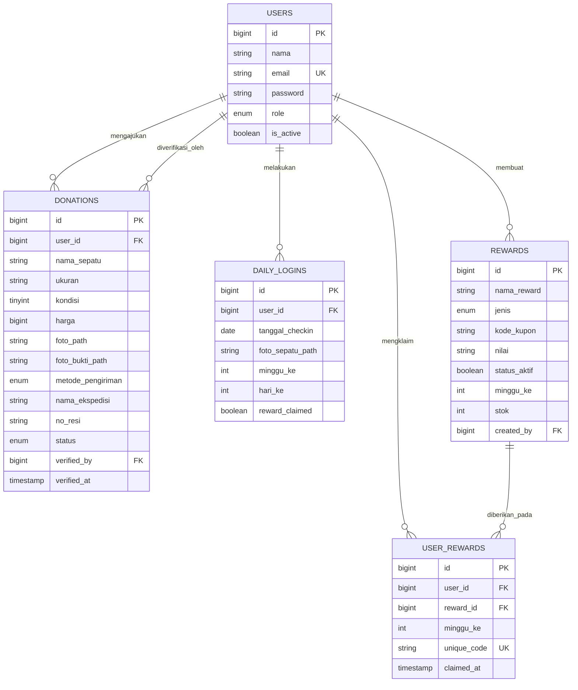

# Product Requirement Document (PRD) — Sepatu Donasi
## Kategori: Core Features (Donasi, Check-In, & Reward)

---

## 1. Pendahuluan & Ringkasan Produk
**Sepatu Donasi** adalah platform sosial digital yang memfasilitasi pengumpulan dan penyaluran sepatu layak pakai dari para donatur kepada pihak yang membutuhkan. Untuk meningkatkan keterlibatan dan retensi pengguna, platform ini mengintegrasikan sistem gamifikasi berupa **Check-in Harian** (dengan verifikasi unggah foto) dan **Sistem Reward** (penukaran kupon berdasarkan streak mingguan).

Dokumen ini memfokuskan kebutuhan fungsionalitas pada tiga pilar utama:
1. **Pilar Donasi**: Formulir pengajuan donasi, metode pengiriman/ekspedisi, dan verifikasi admin dengan bukti visual.
2. **Pilar Check-In**: Perekaman bukti foto sepatu harian untuk membangun streak mingguan.
3. **Pilar Reward**: Manajemen stok hadiah kupon/voucher dan alur penukaran kode unik klaim.

---

## 2. Fitur Utama & Kebutuhan Fungsional

### 2.1. Alur & Fitur Donasi Sepatu
* **Pengajuan Donasi (User)**:
  * Pengguna terdaftar dapat mengirimkan data donasi sepatu dengan mencantumkan: nama sepatu, ukuran (size), kondisi kelayakan (skala persentase 0-100%), taksiran nilai sepatu (harga), deskripsi kondisi, dan foto fisik sepatu.
  * Memilih metode pengiriman: `antar_langsung` (diantar langsung ke gudang donasi) atau `ekspedisi` (menggunakan jasa pengiriman kurir).
  * Pengguna yang memilih ekspedisi dapat memasukkan nama kurir/ekspedisi dan nomor resi pengiriman untuk kemudahan pelacakan.
* **Verifikasi & Manajemen Donasi (Admin)**:
  * Admin meninjau setiap pengajuan donasi di panel admin.
  * Admin berhak menyetujui (`diterima`) atau menolak (`ditolak`) dengan memberikan alasan tertulis di kolom `catatan_admin`.
  * Saat mengubah status donasi menjadi `diterima`, admin wajib mengunggah **Foto Bukti Penerimaan** sebagai tanda sepatu telah sampai di gudang donasi secara fisik dan diverifikasi kesesuaiannya.
  * Admin dapat mengubah status lebih lanjut menjadi `disalurkan` setelah sepatu tersebut didistribusikan ke penerima manfaat.

### 2.2. Alur & Fitur Daily Check-In (Gamifikasi)
* **Perekaman Check-in Harian**:
  * Pengguna terdaftar dapat melakukan check-in satu kali setiap hari dengan mengunggah foto sepatu yang sedang mereka pakai hari itu.
  * Sistem melacak nomor minggu (`minggu_ke`) dan urutan hari dalam minggu tersebut (`hari_ke` dari 1 sampai 7).
  * Kombinasi `user_id` dan `tanggal_checkin` bersifat unik untuk memastikan tidak terjadi kecurangan atau check-in ganda di hari yang sama.
* **Streak Tracking**:
  * Sistem menghitung jumlah check-in aktif berturut-turut dalam satu minggu (streak). Jika streak tercapai penuh (7 hari), status klaim hadiah untuk minggu tersebut diaktifkan.

### 2.3. Alur & Fitur Reward & Kupon
* **Manajemen Reward (Admin)**:
  * Admin dapat mengelola database hadiah, menentukan nama hadiah, jenis (voucher, diskon, sesi perawatan/konsultasi, dll.), deskripsi, nilai manfaat, stok kupon, serta prasyarat `minggu_ke` streak check-in.
  * Menetapkan rentang waktu berlaku hadiah (`berlaku_dari` sampai `berlaku_sampai`).
* **Klaim Reward (User)**:
  * Pengguna yang memenuhi kualifikasi streak check-in 7 hari dapat memilih reward aktif yang sesuai dengan minggu streak tersebut.
  * Setelah berhasil diklaim, stok reward akan berkurang dan sistem akan menorehkan kode klaim acak unik (`unique_code`) ke data klaim pengguna.
  * Kode unik ini digunakan oleh pengguna untuk ditukarkan pada mitra terkait (misalnya laundry sepatu lokal).

---

## 3. Detail Skema Database (Data Dictionary)

Berikut adalah detail struktur tabel MySQL yang mendukung seluruh fitur Donasi, Check-In, dan Reward pada platform ini.

### 3.1. Tabel `users`
Menyimpan data akun pengguna (donatur) dan administrator.
* **Tabel Fisik**: `users`

| Nama Kolom | Tipe Data | Nullable | Default | Deskripsi |
| :--- | :--- | :--- | :--- | :--- |
| `id` | bigint(20) unsigned | No | *Auto Increment* | Primary Key |
| `nama` | varchar(100) | No | - | Nama lengkap pengguna |
| `email` | varchar(150) | No | - | Email pengguna (Unique / Login key) |
| `password` | varchar(255) | No | - | Hash password (BCRYPT) |
| `role` | enum('admin','user') | No | 'user' | Hak akses sistem (Index) |
| `avatar_path` | varchar(255) | Yes | NULL | Lokasi simpan file avatar profil |
| `is_active` | tinyint(1) | No | 1 | Flag status keaktifan akun user |
| `created_at` | timestamp | Yes | NULL | Waktu akun terdaftar |
| `updated_at` | timestamp | Yes | NULL | Waktu data akun diperbarui |

---

### 3.2. Tabel `donations`
Menyimpan seluruh riwayat pengajuan donasi sepatu dari pengguna.
* **Tabel Fisik**: `donations`

| Nama Kolom | Tipe Data | Nullable | Default | Deskripsi |
| :--- | :--- | :--- | :--- | :--- |
| `id` | bigint(20) unsigned | No | *Auto Increment* | Primary Key |
| `user_id` | bigint(20) unsigned | No | - | ID User donatur (FK: `users.id` - Cascade) |
| `nama_sepatu` | varchar(150) | No | - | Nama merek/tipe sepatu |
| `ukuran` | varchar(10) | No | - | Ukuran sepatu (misal: "42", "38") |
| `kondisi` | tinyint(3) unsigned | No | - | Persentase kelayakan fisik (0-100) |
| `harga` | bigint(20) unsigned | Yes | 0 | Estimasi nilai rupiah sepatu |
| `deskripsi` | text | Yes | NULL | Catatan tambahan detail kondisi sepatu |
| `foto_path` | varchar(255) | No | - | Lokasi simpan foto sepatu donatur |
| `foto_bukti_path`| varchar(255) | Yes | NULL | Lokasi simpan foto bukti penerimaan oleh admin |
| `metode_pengiriman`| enum('antar_langsung','ekspedisi') | No | 'ekspedisi' | Cara penyaluran sepatu ke gudang |
| `nama_ekspedisi` | varchar(100) | Yes | NULL | Nama jasa ekspedisi/kurir |
| `no_resi` | varchar(100) | Yes | NULL | Nomor resi pengiriman |
| `status` | enum('pending','diterima','disalurkan','ditolak') | No | 'pending' | Status moderasi donasi (Index) |
| `catatan_admin` | text | Yes | NULL | Alasan penolakan atau catatan verifikasi admin |
| `verified_by` | bigint(20) unsigned | Yes | NULL | Admin pemverifikasi (FK: `users.id` - Null on delete) |
| `verified_at` | timestamp | Yes | NULL | Waktu verifikasi dilakukan |
| `created_at` | timestamp | Yes | NULL | Waktu pengajuan dibuat |
| `updated_at` | timestamp | Yes | NULL | Waktu pengajuan diupdate |

---

### 3.3. Tabel `daily_logins`
Mencatat aktivitas check-in harian pengguna berserta unggahan bukti foto.
* **Tabel Fisik**: `daily_logins`

| Nama Kolom | Tipe Data | Nullable | Default | Deskripsi |
| :--- | :--- | :--- | :--- | :--- |
| `id` | bigint(20) unsigned | No | *Auto Increment* | Primary Key |
| `user_id` | bigint(20) unsigned | No | - | ID User pelaku check-in (FK: `users.id` - Cascade) |
| `tanggal_checkin`| date | No | - | Tanggal pelaksanaan check-in |
| `foto_sepatu_path`| varchar(255) | No | - | Bukti foto sepatu harian |
| `minggu_ke` | int(10) unsigned | No | - | Penanda indeks minggu target |
| `hari_ke` | tinyint(3) unsigned | No | - | Hari ke-n dalam minggu (1-7) |
| `reward_claimed` | tinyint(1) | No | 0 | Flag apakah streak minggu ini sudah ditukar |
| `created_at` | timestamp | No | CURRENT_TIMESTAMP| Waktu perekaman sistem |

*   **Batasan Unik**: Indeks unik `uq_user_tanggal` pada kombinasi `[user_id, tanggal_checkin]` untuk mencegah manipulasi data entri berganda di hari yang sama.

---

### 3.4. Tabel `rewards`
Katalog voucher atau penawaran hadiah yang dikelola oleh admin.
* **Tabel Fisik**: `rewards`

| Nama Kolom | Tipe Data | Nullable | Default | Deskripsi |
| :--- | :--- | :--- | :--- | :--- |
| `id` | bigint(20) unsigned | No | *Auto Increment* | Primary Key |
| `nama_reward` | varchar(150) | No | - | Nama voucher/hadiah |
| `jenis` | enum('voucher','diskon','konsultasi','lainnya') | No | 'voucher' | Kategori hadiah |
| `deskripsi` | text | No | - | Petunjuk penukaran dan syarat hadiah |
| `kode_kupon` | varchar(50) | Yes | NULL | Kode promo dasar |
| `nilai` | varchar(50) | Yes | NULL | Nilai benefit kupon |
| `status_aktif` | tinyint(1) | No | 1 | Status penawaran hadiah aktif/nonaktif (Index) |
| `minggu_ke` | int(10) unsigned | No | - | Target minggu streak check-in (Index) |
| `berlaku_dari` | date | Yes | NULL | Awal masa penukaran kupon |
| `berlaku_sampai` | date | Yes | NULL | Batas akhir kadaluwarsa kupon |
| `stok` | int(11) | Yes | NULL | Jumlah sisa kupon yang tersedia |
| `created_by` | bigint(20) unsigned | Yes | NULL | Admin pembuat data (FK: `users.id` - Null on delete) |
| `created_at` | timestamp | Yes | NULL | Waktu katalog dibuat |
| `updated_at` | timestamp | Yes | NULL | Waktu katalog diperbarui |

---

### 3.5. Tabel `user_rewards`
Mencatat seluruh transaksi penukaran/klaim hadiah oleh pengguna setelah menyelesaikan streak.
* **Tabel Fisik**: `user_rewards`

| Nama Kolom | Tipe Data | Nullable | Default | Deskripsi |
| :--- | :--- | :--- | :--- | :--- |
| `id` | bigint(20) unsigned | No | *Auto Increment* | Primary Key |
| `user_id` | bigint(20) unsigned | No | - | ID User penerima hadiah (FK: `users.id` - Cascade) |
| `reward_id` | bigint(20) unsigned | No | - | ID Reward yang diambil (FK: `rewards.id` - Cascade) |
| `minggu_ke` | int(10) unsigned | No | - | Periode minggu klaim dilakukan |
| `unique_code` | varchar(50) | Yes | NULL | Kode acak unik klaim untuk ditukar di merchant (Unique) |
| `claimed_at` | timestamp | No | CURRENT_TIMESTAMP| Waktu klaim berhasil dicatat |

*   **Batasan Unik**: Indeks unik `uq_user_reward_minggu` pada kombinasi `[user_id, reward_id, minggu_ke]` mencegah pengguna melakukan eksploitasi klaim berkali-kali pada satu jenis reward di minggu yang sama.

---

## 4. Entity Relationship Diagram (ERD)

